# Proyecto Team1

- Manuel Enrique Caita				
- Danny Alexander Riano Gomez				
- Luis Felipe Chacon				
- Carlos Alberto González Cardozo				

Despliegue de una arquitectura en AWS altamente disponible y escalable

## Planificacion

### Identificación de requerimientos.

#### Requerimientos de Negocio

El mundo de las letras

Expandiendo la pasión por la lectura al mundo digital.

La librería El mundo de las Letras es una librería física ubicada en Medellín con más de 20 años,
reconocida en la región por su amplia selección de libros en diferentes géneros y temas. Ha
servido como lugar de encuentro para amantes de la lectura y estudiantes de bachillerato y
universitarios donde además de disfrutar de la lectura o la experiencia de compra de libros,
pueden probar los deliciosos postres que se ofrecen.
El Mundo de las letras con gran experiencia en ventas y asesoría de libros reconociendo el cambio
en los hábitos de compra de los consumidores hacia el comercio electrónico, ha decidido expandir
su presencia en línea para llegar a un público más amplio y mantener su relevancia en un mercado
en constante evolución no solo nacional sino también internacional.

Para respaldar esa plataforma en línea se debe implementar la infraestructura en la nube de AWS
para ofrecer un rendimiento óptimo y una seguridad incomparable.

Dado que en la librería El mundo de las Letras adicionalmente a la expansión en línea
decidieron lanzar una campaña en Instagram para promocionar su vasto catálogo de libros, la
experiencia única de la librería y la variedad de postres. La campaña va a incluir publicaciones
patrocinadas, historias y anuncios dirigidos a usuarios interesados en la lectura y la cultura.
Además de la campaña en Instagram, la librería lanzará una campaña en Facebook para llegar a un
público más amplio y diverso. La campaña incluirá publicaciones en la página de la librería,
anuncio en el feed de noticias y anuncios dirigidos a grupos específicos de usuarios basados en sus
intereses y comportamientos en línea.
Para captar la atención de los usuarios que buscan activamente libros y contenido relacionado en
línea, la librería lanzará también una campaña en Google Ads. La campaña incluirá anuncios de
búsqueda relacionadas con libros y lectura en Google y Youtube.
El éxito de estas campañas de publicidad generará un aumento significativo en la visibilidad y el
interés por parte del público hacia la librería El Mundo de las Letras tanto en su tienda física como
en su plataforma en línea.
Se debe prever que el aumento de tráfico puede afectar la experiencia de usuario de la plataforma
en línea y ha identificado la necesidad de mejorar y escalar la infraestructura tecnológica para
satisfacer la demanda creciente y mantener la experiencia positiva de los clientes en línea.

#### Requerimientos Funcionales:

La infraestructura a implementar debe contar con lo siguiente:
* Desarrollar la plataforma web que permita a los clientes explorar los diferentes libros.
* Implementar la red en la nube de AWS.
* La subred pública actuará como la puerta de entrada a la plataforma en línea, brindando a los
usuarios acceso a internet y una experiencia de navegación fluida.
* Las subredes privadas estarán protegidas contra accesos no autorizados desde internet
garantizando la seguridad de los datos sensibles de la librería.
En una de estas subredes se aprovisionará la base de datos RDS.
* La instancia EC2 debe poder conectarse a la base de datos en la subred
privada.
* Para mantener un nivel óptimo de seguridad, se crearán usuarios IAM
con roles específicos:
  - El primer usuario es el administrador del servidor web por lo tanto
tendrá los siguientes permisos:
    - EC2 Full Access
    - SSM Full Access
    - EC2InstanceConnect
  - El segundo usuario es el administrador de las bases de datos RDS por
lo tanto tendrá los siguientes permisos:

    - RDS Full Access
  - El tercer usuario tendrá permisos de auditoría sobre la base de datos RDS, limitándose a
funciones de lectura para garantizar la integridad de los datos.
  -   El cuarto usuario será responsable de la auditoría de la instancia EC2 y tendrá permisos
de solo lectura, protegiendo así la seguridad de la plataforma web.
* Arquitectura resiliente, altamente escalable, disponible y segura.  
* Implementar la siguiente infraestructura de red:
  - 1 VPC
  - 2 zonas de disponibilidad.
  - 1 Internet Gateway
  - 2 subredes publica en cada zona de disponibilidad.
  - 4 subredes privadas, 2 en cada zona de disponibilidad.
  - 2 Elastic IPs
  - 2 NatGateways
 * Debe configurar un Subnet Group con las dos subredes privadas.  
    (Verificar que cada subred esté en una zona de disponibilidad diferente).
  
* En una de las subredes pública implementar un Bastión Host (Instancia EC2) que sirva para
acceder a las instancias en las subredes privadas. En este Bastión Host se configurará el servidor
web que será lanzado en las instancias en las dos subredes privadas.
* Configurar el servicio RDS en las otras dos subredes privadas.
* 3 EC2 Instances
* 1 S3 bucket
* 1 Relational Database Service (RDS)
* Configurar el servicio de Auto Scaling Group.
* Configurar el Load Balancing.
* Realizar una prueba de estrés para verificar el funcionamiento del Auto Scaling Group.

### Diagrama de arquitectura.
En la siguiente imagen se muestra el diseño de la arquitectura a partir de los requerimientos.

  
### Identificar Roles.   

| Role                     | Nombre          |
| ------------------------ | --------------- |
| Web administrator        | Felipe Chacon   |
| Data Base administrator  | Danny Riano     |
| RDS audit                | Carlos Gonzalez |
| EC2 audit                | Manuel Caita    |

Imagen final de la creacion de los distintos roles haciendo uso del modulo AWS-IAM, esta creacion esta asociada al pilar de seguridad del AWS Well-Architected-Framework.
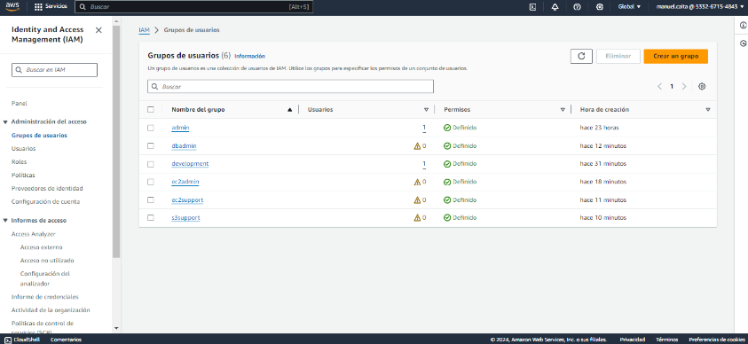

* Web administrator
* Data Base administrator
* Relational Database Service (RDS) audit
* EC2 audit

### Diagrama de Gantt.
En la siguiente imagen se muestra el tiempo de dedicación previsto para las diferentes actividades requeridas para el proyecto   
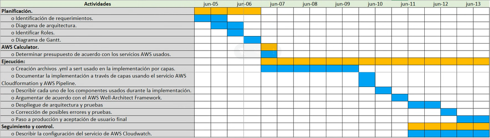    

El documento en excel con el detalle de las tareas esta disponible en el siguiente link [Diagrama Gantt](source/Diagrama%20de%20Gantt.xlsx)


### Determinar presupuesto de acuerdo con los servicios AWS usados.
Imagen final del AWS Calculator, este calculo esta asociada al pilar de optimización de costos del AWS Well-Architected-Framework.

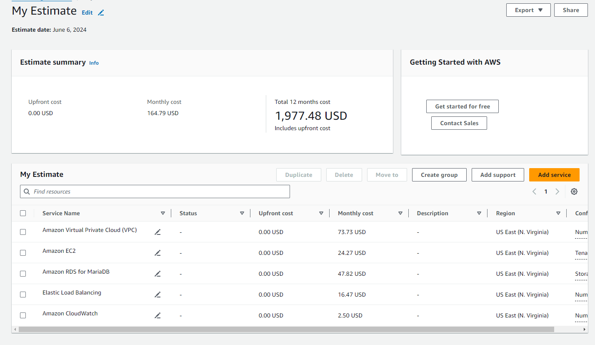
El documento PDF con el detalle del pricing esta disponible en el siguiente link [PDF Pricing](source/AWSPricingCalculator.pdf)


## Ejecucion
Para la creacion de los recursos que satisfagan los requerimientos y recursos que nos hemos planteado seguiremos los 6 pilares del AWS Well-Architected Framework <br> y lo vamos a divirdir en dos archivos, el primer archivo lo vamos a confgurar con la parametrizaciones de red, como lo es la vpc, las subredes, internet gateway, nat gateway,  route tables y routes, lo llamaremos como network.yaml

> [!IMPORTANT]
> En esta seccion se va a explicar el contenido que los archivos pricipales para configurar nuestra arquitectura dentro de aws.
<p>Primero tenemos la seccion de parametros.<p>
En esta seccion vamos a asociar la vpc a una ip, esto lo hacemos dentro del bloque de parametros en el yaml.

```
AWSTemplateFormatVersion: "2010-09-09"

Description:
  This template deploys the architecture with one VPC, two public subnets and two private subnets

Parameters:
 
  VpcCIDR:
    Type: String
    Default: 172.16.0.0/16
```
> [!NOTE]
>Vamos asociar las subnets a una ip por cada subnet, cada rango de ip debe ser diferente para que no se traslapen estas subredes.
```
  PublicSubnetAIP:
    Type: String
    Default: 172.16.1.0/24

  PublicSubnetBIP:
    Type: String
    Default: 172.16.2.0/24
  
  PrivateSubnetAIP:
    Type: String
    Default: 172.16.3.0/24
  
  PrivateSubnetBIP:
    Type: String
    Default: 172.16.4.0/24
    
  PrivateSubnetAAIP:
    Type: String
    Default: 172.16.5.0/24
    
  PrivateSubnetBBIP:
    Type: String
    Default: 172.16.6.0/24
```

> [!NOTE]
>Luego tenemos la seccion de recusos, en la cual vamos a definir los recursos que vamos a crear y que son necesarios para el despliegue.
Vamos a tener la creacion de la vpc, la cual se crea como un recurso de EC2,  la asociamos con el nombre que asociamos  en los recursos y asignamos la ip, esto nos permitira asignarle el rango de ip que se configuro anteriormente a la vpc que estamos creando.
```
Resources:
  VPC:
    Type: AWS::EC2::VPC
    Properties:
      CidrBlock: 
        Ref: VpcCIDR
      EnableDnsHostnames: true
      Tags:  
        - Key: Name
          Value: VPC-WEB-SERVER-BOOK 
```
> [!NOTE]
>Se realiza la configuracion para la creacion de las subnets, aqui la asociamos a la vpc que creamos, definimos una zona de disponibilidad, la asociamos a los parametros que teniamos anteriormente cuando definimos los parametros y las ip, esto lo debemos hacer para cada subnet, lo que va a cambiar son los nombres y la zona de disponibilidad.
```
  PublicSubnetA:
    Type: AWS::EC2::Subnet
    Properties:
      VpcId: 
        Ref: VPC
      AvailabilityZone: us-east-1a
      CidrBlock: 
        Ref: PublicSubnetAIP
      Tags:
        - Key: Name
          Value: PublicSubnetA 

  PublicSubnetB:
    Type: AWS::EC2::Subnet
    Properties:
      VpcId: 
        Ref: VPC
      AvailabilityZone: us-east-1b
      CidrBlock: 
        Ref: PublicSubnetBIP
      Tags:
        - Key: Name
          Value: PublicSubnetB 
```
> [!NOTE]
>Vamos a configurar el internet gateway, en la cual creamos el recurso le damos un nombre y tambien lo vamos asociar al internet gateway con la vpc.
```
  InternetGateway:
    Type: AWS::EC2::InternetGateway
    Properties:
      Tags:
        - Key: Name
          Value: IG_WSC

  InternetGatewayAttachment:
    Type: AWS::EC2::VPCGatewayAttachment
    Properties:
      InternetGatewayId: 
        Ref: InternetGateway
      VpcId: 
        Ref: VPC 
```
> [!NOTE]
>En esta seccion vamos a crear la route table y sera asociada a la vpc que se creo, esta se encargara de redirigir el trafico.
```
  PublicRouteTable:
    Type: AWS::EC2::RouteTable
    Properties:
      VpcId: 
        Ref: VPC
      Tags:
        - Key: Name
          Value: Public_Routes

#luego vamos  a crear una route, esta route la tenemos que refenciar  a la route table que creamos, al internet gateway,tambien al attach del internet gateway y la vpc.
  PublicRouteA:
    Type: AWS::EC2::Route
    DependsOn: InternetGatewayAttachment
    Properties:
      RouteTableId:
        Ref: PublicRouteTable
      DestinationCidrBlock: 0.0.0.0/0
      GatewayId: 
        Ref: InternetGateway          
```

> [!NOTE]
>En esta seccion vamos asociar la route table a cada una de las redes publicas que creamos, hacemos relacion a que route table vamos asociar y a que subnet la queremos asociar.
```
  PublicSubnet1RouteTableAssociation:
    Type: AWS::EC2::SubnetRouteTableAssociation
    Properties:
      RouteTableId: 
        Ref: PublicRouteTable
      SubnetId: 
        Ref: PublicSubnetA

  PublicSubnet2RouteTableAssociation:
    Type: AWS::EC2::SubnetRouteTableAssociation
    Properties:
      RouteTableId: 
        Ref: PublicRouteTable
      SubnetId: 
        Ref: PublicSubnetB
```
> [!NOTE]
>Vamos a crear el recurso de la nat gateway, esto nos permitira que nos podamos conectar a intenet, como tenemos dos subredes publicas debemos crear dos nat gateway, cada una la vamos a asociar a un subred y le vamos a asociar un ip elastica, esta asociasion la vamos a realizar por medio del nombre de la ip elastica.
```
  NatGatewayA:
    Type: AWS::EC2::NatGateway
    Properties:
      AllocationId: !GetAtt AipELASTIC.AllocationId
      SubnetId:
        Ref: PublicSubnetA
      Tags:
        - Key: Name
          Value: NatGatewayA-subnetPublicA

  NatGatewayB:
    Type: AWS::EC2::NatGateway
    Properties:
      AllocationId: !GetAtt BipELASTIC.AllocationId
      SubnetId:
        Ref: PublicSubnetB
      Tags:
        - Key: Name
          Value: NatGatewayA-subnetPublicB
```
> [!NOTE]
>En esta seccion vamos a crear la configuracion para las ip elasticas, debemos tener dos ip elasticas estas son para cada nat gateway y las asociamos a la vpc que creamos
```
  ##Elastic IP
  AipELASTIC:
    Type: AWS::EC2::EIP
    Properties:
      Domain:
        Ref: VPC
      Tags: 
        - Key: Name
          Value: EIP-nwA
  
  BipELASTIC:
    Type: AWS::EC2::EIP
    Properties:
      Domain:
        Ref: VPC
      Tags: 
        - Key: Name
          Value: EIP-nwB
```
> [!NOTE]
>En esta seccion vamos a crear 2 route tables asociadas a la vpc y estas las asociaremos a las nat gateway. Esta configuracion esta ligada al AWS Well-Architected-Framework dentro del pilar de seguridad.
```
  RouteTableNatGatewayA:
    Type: AWS::EC2::RouteTable
    Properties:
      VpcId: 
        Ref: VPC
      Tags:
        - Key: Name
          Value: Route-NW-A
  
  RouteTableNatGatewayB:
    Type: AWS::EC2::RouteTable
    Properties:
      VpcId: 
        Ref: VPC
      Tags:
        - Key: Name
          Value: Route-NW-B
```
> [!NOTE]
>Debemos crear una route para cada una de las route table que creamos, le definimos quien puede conectarse, lo asociamos a cada nat gateway
```
  PublicRouteNgA:
    Type: AWS::EC2::Route
    Properties:
      RouteTableId:
        Ref: RouteTableNatGatewayA
      DestinationCidrBlock: 0.0.0.0/0
      NatGatewayId: 
        Ref: NatGatewayA

  PublicRouteNgAB:
    Type: AWS::EC2::Route
    Properties:
      RouteTableId:
        Ref: RouteTableNatGatewayB
      DestinationCidrBlock: 0.0.0.0/0
      NatGatewayId: 
        Ref: NatGatewayB          
```
> [!NOTE]
>Vamos asociar nuestra route table con el natgateway y con la subnet,sera la que deseamos asociar
```
  NWARouteAssociation:
    Type: AWS::EC2::SubnetRouteTableAssociation
    Properties:
      RouteTableId: 
        Ref: RouteTableNatGatewayA
      SubnetId: 
        Ref: PrivateSubnetA

  NWBRouteAssociation:
    Type: AWS::EC2::SubnetRouteTableAssociation
    Properties:
      RouteTableId: 
        Ref: RouteTableNatGatewayB
      SubnetId: 
        Ref: PrivateSubnetB
```
> [!NOTE]
>como outputs para este archivo yaml vamos a tener nombres de recursos como lo son las subredes y la vpc

```
Outputs:

  VPC: 
    Description: VPC ID
    Value: 
      Ref: VPC
    Export:
      Name: !Sub '${AWS::StackName}-VPCID'

  PublicSubnetA:
    Description: Public Subnet A ID
    Value: 
      Ref: PublicSubnetA
    Export:
      Name: !Sub '${AWS::StackName}-PublicSubnetA'

  PublicSubnetB:
    Description: Public Subnet B ID
    Value: 
      Ref: PublicSubnetB
    Export:
      Name: !Sub '${AWS::StackName}-PublicSubnetB'

  PrivateSubnetA:
    Description: Private Subnet A ID
    Value: 
      Ref: PrivateSubnetA
    Export:
      Name: !Sub '${AWS::StackName}-PrivateSubnetA'
  
  PrivateSubnetB:
    Description: Private Subnet B ID
    Value: 
      Ref: PrivateSubnetB
    Export:
      Name: !Sub '${AWS::StackName}-PrivateSubnetB'

  PrivateSubnetAA:
    Description: Private Subnet AA ID
    Value: 
      Ref: PrivateSubnetAA
    Export:
      Name: !Sub '${AWS::StackName}-PrivateSubnetAA'
  
  PrivateSubnetBB:
    Description: Private Subnet BB ID
    Value: 
      Ref: PrivateSubnetBB
    Export:
      Name: !Sub '${AWS::StackName}-PrivateSubnetBB'
```


En el siguiente archivo vamos a tener la siguiente configuracion, en este vamos a manejar la configuracion interna que se necesito como por ejmeplo los segurity group, la imtancia pricipal que contendra nuestra aplicacion y el load balencer entro otros.

> [!NOTE]
>Aqui tendremos la explicacion del contenido del archivo application.yml, en este archivo encontraremos la configuracion de los security groups 

Vamos a crear el SG para la intancia principal, en esta seccion podemos ver que le podemos configurar y permitir el tipo de conexion que deseamos que tenga, tambien le asiganmos los puertos que van hacer permitidos para la conexion. Esta conexion esta ligada  al AWS Well-Architected-Framework dentro del pilar de seguridad.
```
Resources:

#Create the SG for instance
  SGbookPublic:
    Type: AWS::EC2::SecurityGroup
    Properties:
      GroupDescription: Allow connection through SSH
      SecurityGroupIngress:
        - IpProtocol: tcp
          FromPort: 22
          ToPort: 22
          CidrIp: 0.0.0.0/0
        - IpProtocol: tcp
          FromPort: 5000
          ToPort: 5000
          CidrIp: 0.0.0.0/0
      Tags:
        - Key: Name
          Value: sg-book-ws
      VpcId:
        Fn::ImportValue:
          !Sub "network-stack-VPCID"
        
  #Create the SG for instance in subnet private
  SGbookPrivate:
    Type: AWS::EC2::SecurityGroup
    Properties:
      GroupDescription: Allow connection through SSH and HTTP for instance un subnet private
      SecurityGroupIngress:
        - IpProtocol: tcp
          FromPort: 22
          ToPort: 22
          SourceSecurityGroupId: !GetAtt SGbookPublic.GroupId
        - IpProtocol: tcp
          FromPort: 5000
          ToPort: 5000
          SourceSecurityGroupId: !GetAtt SGalb.GroupId
      Tags:
        - Key: Name
          Value: sg-book-private
      VpcId:
        Fn::ImportValue:
          !Sub "network-stack-VPCID"

  #Create the SG for ALB
  SGalb:
    Type: AWS::EC2::SecurityGroup
    Properties:
      GroupDescription: Allow connection through HTTP
      SecurityGroupIngress:
        - IpProtocol: tcp
          FromPort: 80
          ToPort: 80
          CidrIp: 0.0.0.0/0     
      Tags:
        - Key: Name
          Value: sg-alb
      VpcId:
        Fn::ImportValue:
          !Sub "network-stack-VPCID"

  #Create the SG for DB
  SGdb:
    Type: AWS::EC2::SecurityGroup
    Properties:
      GroupDescription: Allow connection through SSH and MYSQL for DB in subnet private
      SecurityGroupIngress:
        - IpProtocol: tcp
          FromPort: 22
          ToPort: 22
          CidrIp: 0.0.0.0/0
        - IpProtocol: tcp
          FromPort: 3306
          ToPort: 3306
          CidrIp: 0.0.0.0/0
      Tags:
        - Key: Name
          Value: sg-db
      VpcId:
        Fn::ImportValue:
          !Sub "network-stack-VPCID"
```

> [!NOTE]
>En la siguiente seccion vamos a crear la intancia pricipal, le debemos definir la zona en donde lo queremos y debemos defir o crear un keypair para este despliegue de la infraestructura y asociar el nombre de la kay pair al yaml, asociamos el segurity group al cual lo vamos a asociar, en la intancia tambien podemos pasarle los comando que queremos que se ejecuten, por ejemplo en esta intancia estamos haciendo la instalacion de las herramientas o complementos que necesitamos para ejecutar nuestra aplicacion dentro de la intancia, estamos tambien descargando archivos de un bucket y los estamos almacenando y descomprimiendo e incluso estamos alimentando los datos d ela base de datos en rds directamente y tambien creamos el launchtemplate con la informacion que se desa configurar como el kay pair, el sg, esta sera para la conmfiguracion para lanzar la intancia que deseamos crear, tenemos una instancia pequeña debido a la configuracion que vamos a tener.

```
  #Create the instance
  bookWSpublic:
    Type: AWS::EC2::Instance
    DependsOn:
      - DBbook
    Properties:
      AvailabilityZone: us-east-1a
      ImageId: ami-0bb84b8ffd87024d8
      InstanceType: t2.micro
      IamInstanceProfile: rolebookacces
      KeyName: keyfin
      NetworkInterfaces:
        - AssociatePublicIpAddress: true
          DeviceIndex: 0
          SubnetId:
            Fn::ImportValue:
              !Sub "network-stack-PublicSubnetA"
          GroupSet:
            - Ref: SGbookPublic       
      Tags:
        - Key: Name
          Value: book-ws-public
      UserData: 
        Fn::Base64: !Sub | 
          #!/bin/bash
          sudo dnf install -y python3.9-pip
          pip install virtualenv
          sudo dnf install -y mariadb105-server
          sudo service mariadb start
          sudo chkconfig mariadb on
          pip install flask
          pip install mysql-connector-python
          pip install boto3
          wget https://jav-bucket-web.s3.amazonaws.com/python-db-ssm.zip          
          wget https://jav-bucket-web.s3.amazonaws.com/databases.zip
          wget https://jav-bucket-web.s3.amazonaws.com/BookDbDump.sql
          sleep 2
          sudo unzip python-db-ssm.zip
          sudo unzip databases.zip 
          sudo mv python-db-ssm databases /home/ec2-user
          wget https://jav-bucket-web.s3.amazonaws.com/bookapp.service
          sudo mv bookapp.service /etc/systemd/system
          DB_PASSWORD=$(aws ssm get-parameter --name "/book/password" --query "Parameter.Value" --output text --region "us-east-1")
          mysql -u root -p$DB_PASSWORD --host ${DBbook.Endpoint.Address} < BookDbDump.sql
          sudo systemctl daemon-reload
          sudo systemctl start bookapp
          sudo systemctl enable bookapp  
        
  ##Create a launch Template
  LaunchTemplateBook:
    Type: AWS::EC2::LaunchTemplate
    DependsOn:
      - DBbook
    Properties:
      LaunchTemplateData:
        IamInstanceProfile: 
          Name: rolebookacces
        ImageId: ami-0bb84b8ffd87024d8
        KeyName: keyfin
        InstanceType: t2.micro
        SecurityGroupIds: 
          - Ref: SGbookPrivate  
        UserData: 
          Fn::Base64: !Sub | 
            #!/bin/bash
            sudo dnf install -y python3.9-pip
            pip install virtualenv
            sudo dnf install -y mariadb105-server
            sudo service mariadb start
            sudo chkconfig mariadb on
            pip install flask
            pip install mysql-connector-python
            pip install boto3
            wget https://jav-bucket-web.s3.amazonaws.com/python-db-ssm.zip          
            wget https://jav-bucket-web.s3.amazonaws.com/databases.zip
            wget https://jav-bucket-web.s3.amazonaws.com/BookDbDump.sql
            sleep 2
            sudo unzip python-db-ssm.zip
            sudo unzip databases.zip 
            sudo mv python-db-ssm databases /home/ec2-user
            wget https://jav-bucket-web.s3.amazonaws.com/bookapp.service
            sudo mv bookapp.service /etc/systemd/system
            DB_PASSWORD=$(aws ssm get-parameter --name "/book/password" --query "Parameter.Value" --output text --region "us-east-1")
            mysql -u root -p$DB_PASSWORD --host ${DBbook.Endpoint.Address} < BookDbDump.sql
            sudo systemctl daemon-reload
            sudo systemctl start bookapp
            sudo systemctl enable bookapp 
      LaunchTemplateName: lt-book 

```

> [!NOTE]
>En este bloque vamos a tener la configuracion necesaria para el laoad balancer que vamos a configurar, para ello debemos asociarlo a una subnet, en este caso sera a las dos subnet publicas que creamos, esta asociasion la hacemos mediante la extraccion del nombre, tambien vamos a tener la configuracion del target group este nos ayudara a enrutar el trafico mediante unas reglas, tambien definimos el path para configurar los health checks para las instancias, se debe crear el listener este sera el encargado de escuchar las peticiones y definimos el puerto al cual deseamos tener permitido escuchar. Esta creacion esta asociada al pilar de seguridad del AWS Well-Architected-Framework.

```
  ##Create the Application Load Balancer
  ALBbook:
    Type: AWS::ElasticLoadBalancingV2::LoadBalancer
    Properties:
      Name: alb-book
      Scheme: internet-facing
      SecurityGroups: 
        - Ref: SGalb
      Subnets: 
        - Fn::ImportValue: !Sub "network-stack-PublicSubnetA"
        - Fn::ImportValue: !Sub "network-stack-PublicSubnetB"
      Type: application

  #Create the target group
  TGelb:
    Type: AWS::ElasticLoadBalancingV2::TargetGroup
    Properties:
      HealthCheckEnabled: true
      HealthCheckPath: /health
      Name: tg-wsbook
      Port: 5000
      Protocol: HTTP
      TargetType: instance
      VpcId: 
        Fn::ImportValue:
          !Sub "network-stack-VPCID"

  #Create a listener for ALB
  ListenerALB:
    Type: AWS::ElasticLoadBalancingV2::Listener
    Properties:
      LoadBalancerArn: 
        Ref: ALBbook
      Port: 80
      Protocol: HTTP 
      DefaultActions:
        - Type: forward 
          TargetGroupArn: 
            Ref: TGelb  
``` 

> [!NOTE]
>En esta seccion tenemos la configuracion  del auto scaling group, para este debemos asociar un sg y vamos a definir las intancias con las cuales minimo trabajaremos y maximo tendremos, esto es para tener una alta disponibiliad de la aplicacion, tambien vamos a definir la polita para el escalamiento, en este caso lo vamos a hacer mediante al consumo de cpu, si el consumo es mayor a 75 comenzara a escalar y aprovisionar el nuevo recurso. Esta creacion esta asociada al pilar de fiabilidad, pilar de eficacia y rendimiento y pilar de optimizacion de costos del AWS Well-Architected-Framework.

``` 
  #Create the Auto Scaling group
  ASGbook:
    Type: AWS::AutoScaling::AutoScalingGroup
    Properties:
      AutoScalingGroupName: asg-book
      DesiredCapacity: 2
      MaxSize: 4
      MinSize: 2
      LaunchTemplate: 
        LaunchTemplateId: 
          Ref: LaunchTemplateBook          
        Version: !GetAtt LaunchTemplateBook.LatestVersionNumber
      TargetGroupARNs: 
        - Ref: TGelb
      VPCZoneIdentifier: 
        - Fn::ImportValue: !Sub "network-stack-PrivateSubnetA"
        - Fn::ImportValue: !Sub "network-stack-PrivateSubnetB"

  #Create the Scaling policy
  ScalingPolicyASG:
    Type: AWS::AutoScaling::ScalingPolicy
    Properties:
      AutoScalingGroupName: 
        Ref: ASGbook
      PolicyType: TargetTrackingScaling
      TargetTrackingConfiguration: 
        PredefinedMetricSpecification: 
          PredefinedMetricType: ASGAverageCPUUtilization
        TargetValue: 75
```

> [!NOTE]
>En este segmento vamos a configurar las caracteristicas de nuestra base de datos, definimos caracteristicas del tipo de maquina que va a componerla el sg que va a tener la zona en la cual vamos a deplegarla y agregamos el subnetgroup a la base de datos en este caso la vamos a asociar para nuestras dos subnets privadas. esta creacion esta asociada al pilar de fiabilidad del AWS Well-Architected-Framework.

```
   ##Create the databases
  DBbook:
    Type: AWS::RDS::DBInstance
    Properties:
      AllocatedStorage: 20
      AvailabilityZone: us-east-1a
      DBInstanceIdentifier: databasebook
      DBInstanceClass: db.t3.micro
      DBName: dbbook
      DBSubnetGroupName: 
        Ref: DBbookSubnetGroup
      Engine: mariadb
      VPCSecurityGroups:
        - Ref: SGdb
      MasterUsername: root
      MasterUserPassword: '{{resolve:ssm:/book/password:1}}'

  ##Create the subnets
  DBbookSubnetGroup:
    Type: AWS::RDS::DBSubnetGroup
    Properties:
      DBSubnetGroupDescription: Subnets about db
      DBSubnetGroupName: db-subnet-group-db
      SubnetIds:
        - Fn::ImportValue: !Sub "network-stack-PrivateSubnetAA"
        - Fn::ImportValue: !Sub "network-stack-PrivateSubnetBB"

```

> [!NOTE]
>como outputs vamos a tener los nombres de recursos o obtener los datos de las ip, esto lo hacemos mediante esta opción !Sub "netwoRk-stack-book-ws-public" e incluso obtenemos en endpoint de la abse de datos

```
Outputs:
  bookWSpublic:
    Description: Public IP of the book-ws
    Value: !GetAtt bookWSpublic.PublicIp
    Export:
      Name: !Sub "netwoRk-stack-book-ws-public"
  bookWSprivate:
    Description: Private IP of the book-ws
    Value: !GetAtt bookWSpublic.PrivateIp
    Export:
      Name: !Sub "network-stack-book-ws-private"
  bookWSALB:
    Description: ALB of the book-ws
    Value: !GetAtt ALBbook.DNSName
    Export:
      Name: !Sub "network-stack-book-ws-alb"
  SGdb:
    Description: SG for DB
    Value:
      Ref: SGdb
    Export:
      Name: !Sub "network-stack-SGdb"
  DBbook:
    Description: Database endpoint
    Value: !GetAtt DBbook.Endpoint.Address
```
> [!IMPORTANT]
>Se debe validar que todo este bien en nuestro template.
```
#primero validamos si esta todo correctamente en el template
aws cloudformation validate-template --template-body file://network.yml
```

> [!IMPORTANT]
Para el despliegue aplicaremos el proceso de automatizacion de cambios incluido dentro del pilar de excelencia operativa del AWS well-architected-Framework.
> 
para el despliegue de nuestros archivos vamos a crear un repositorio dentro de aws esto lo hacemos mediante el siguiente comando.

```
aws codecommit create-repository --repository-name proyecto-cicd --repository-description "automatizar despliegue de infraestructura"
```

luego podemos validar si se creo el repositorio con el siguiente codigo:
```
aws codecommit get-repository --repository-name proyecto-cicd
```

ahora debemos clonar el repositorio en nuestro local, vamos a cargar el contenido de los archivos network.yml y application.yml
```
git clone remplazar por la url del repositorio creado en aws
```
luego vamos a agregar los cambios mediante
```
git add .
#aplicamos el commit para subir los cambios
git commit -m “configurando capa de red”
#luego el push para subir los datos
git push codecommit::us-east-1://nombrerepositorio
```
debemos crear un pipeline para que automaticamente se aplique los cambio cuando se hace un push a este repositorio, necesitamos 1 pipeline por cada archivo subido al repositorio, mediante este pipeline se realiza el CI/CD para nuestro proceso

## Seguimiento y Control
Aplicando el pilar de la Excelencia Operativa y optimizacion de costos del AWS Well-Architected Framework, implementamos CloudWatch para la supervision y control
Describir la configuración del servicio de AWS Cloudwatch.

Instalación del Agente  <br>
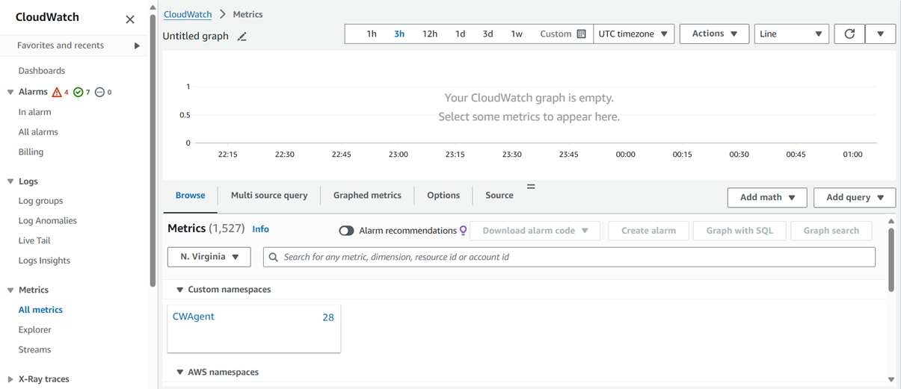    
<br> Creación del Parameter  
<br>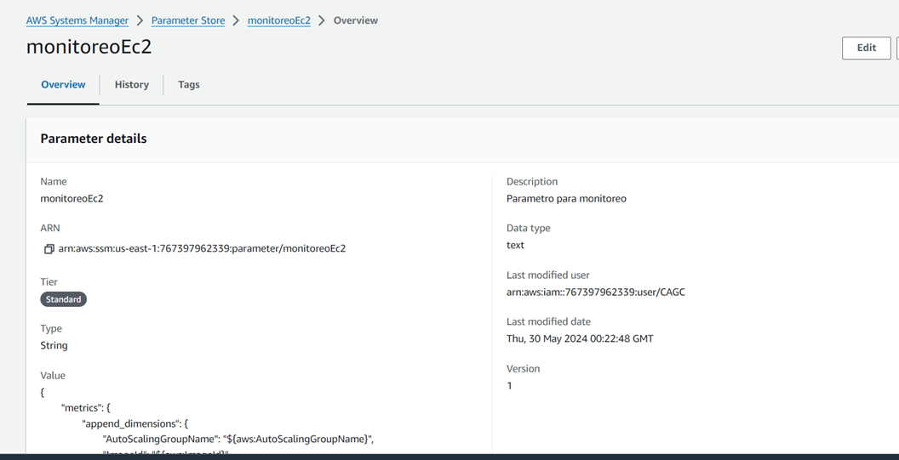  
<br>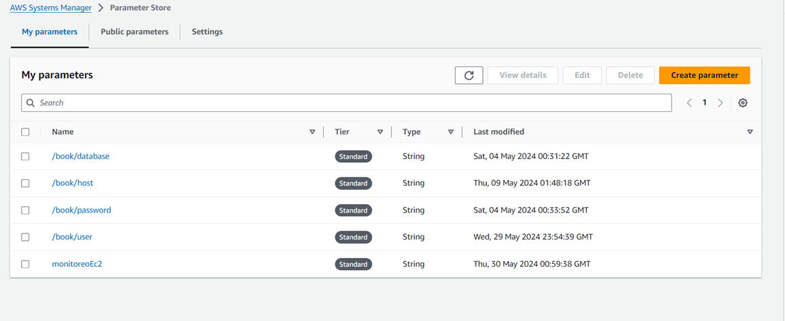  
<br>Creación de la Alarma  
<br>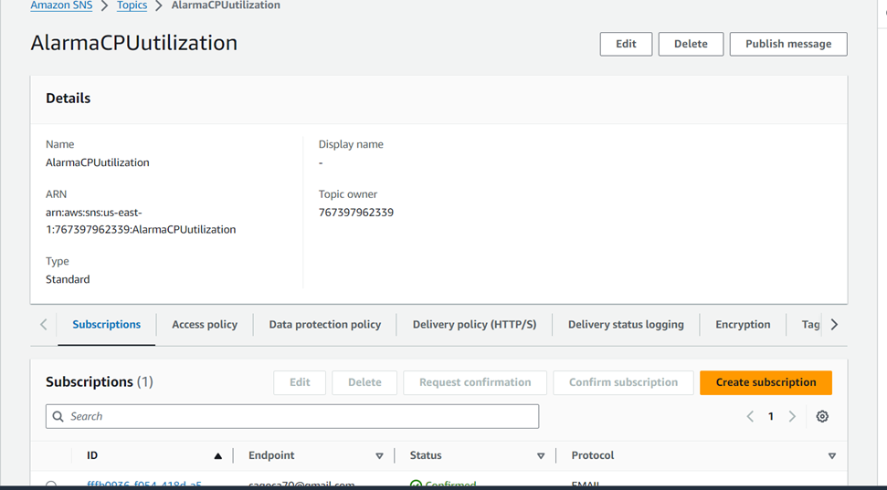  
<br>Alarma Activada   
<br>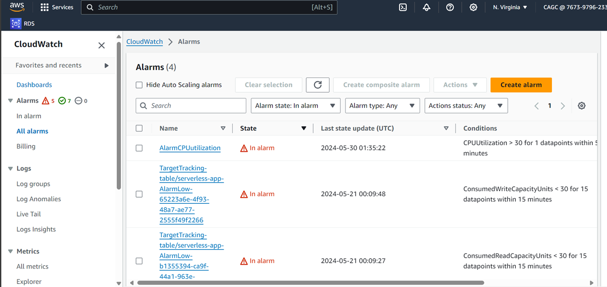  
<br>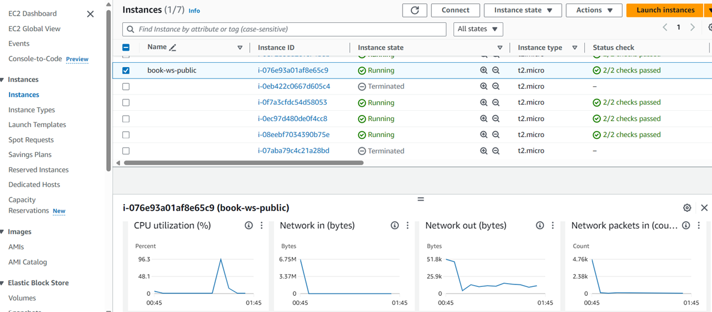  
<br>
<br>Mail Alarm Generación de la alarma  
<br>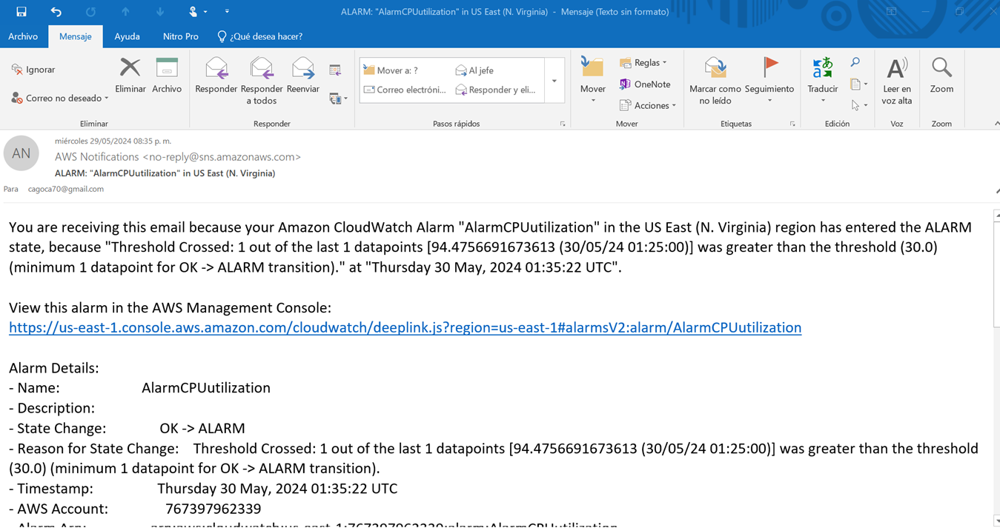  
<br>Se restablece la alarma   
<br>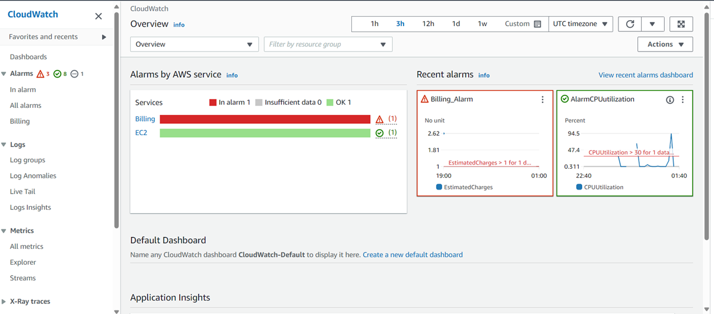  
<br>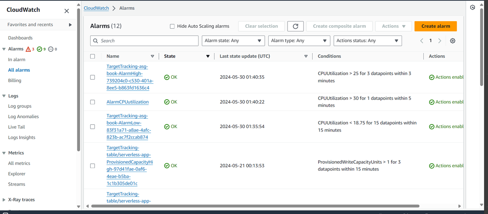  


